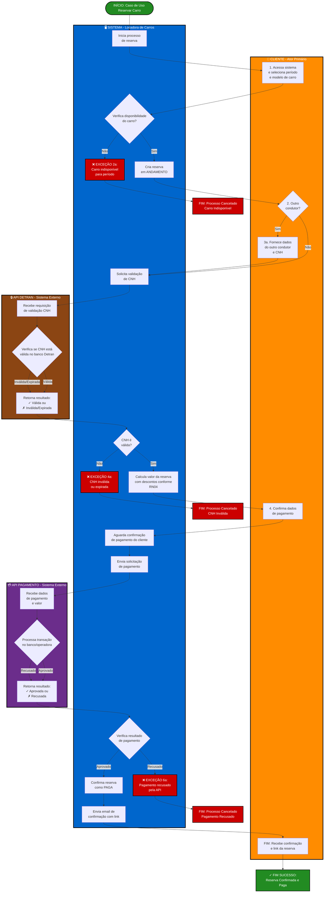

O Diagrama de Atividades modela a lógica de negócio do caso de uso "Reservar Carro" utilizando raias de natação para separar as responsabilidades entre Cliente (ator primário), Sistema de Locadora (sistema em foco), API Detran e API Pagamento (atores secundários/sistemas externos).

### Grafo de Fluxo de Controle (GFC)

O GFC mapeia cada atividade e decisão do diagrama de atividades para nós numerados, permitindo a derivação de casos de teste baseados em caminhos estruturais.

```mermaid
graph TD
    N1["<b>1</b><br/>INÍCIO<br/>Reservar Carro"]
    N2["<b>2</b><br/>S1: Inicia<br/>processo reserva"]
    N3["<b>3</b><br/>C1: Cliente seleciona<br/>período e modelo"]
    N4{"<b>4</b><br/>S2: Carro<br/>disponível?"}
    N5["<b>5</b><br/>S2N: EXCEÇÃO<br/>Carro indisponível"]
    N6["<b>6</b><br/>S3: Cria reserva<br/>em ANDAMENTO"]
    N7{"<b>7</b><br/>C2: Outro<br/>condutor?"}
    N8["<b>8</b><br/>C3: Fornece dados<br/>outro condutor"]
    N9["<b>9</b><br/>S4: Solicita<br/>validação CNH"]
    N10["<b>10</b><br/>D1: Detran<br/>recebe requisição"]
    N11{"<b>11</b><br/>D2: Detran verifica<br/>CNH válida?"}
    N12["<b>12</b><br/>D3: Detran retorna<br/>resultado"]
    N13{"<b>13</b><br/>S5: CNH é<br/>válida?"}
    N14["<b>14</b><br/>S5N: EXCEÇÃO<br/>CNH inválida"]
    N15["<b>15</b><br/>S6: Calcula desconto<br/>RN04"]
    N16["<b>16</b><br/>C4: Cliente confirma<br/>pagamento"]
    N17["<b>17</b><br/>S7: Aguarda<br/>confirmação"]
    N18["<b>18</b><br/>S8: Envia solicitação<br/>pagamento"]
    N19["<b>19</b><br/>P1: API Pagamento<br/>recebe"]
    N20{"<b>20</b><br/>P2: Pagamento<br/>aprovado?"}
    N21["<b>21</b><br/>P3: API retorna<br/>resultado"]
    N22{"<b>22</b><br/>S9: Verifica<br/>resultado?"}
    N23["<b>23</b><br/>S9N: EXCEÇÃO<br/>Pagamento recusado"]
    N24["<b>24</b><br/>S10: Confirma<br/>PAGA"]
    N25["<b>25</b><br/>S11: Envia email<br/>confirmação"]
    N26["<b>26</b><br/>C5: Cliente recebe<br/>link"]
    N27["<b>27</b><br/>FIM SUCESSO<br/>Reserva confirmada"]
    FIM1["FIM<br/>Cancelado"]
    FIM2["FIM<br/>Cancelado"]
    FIM3["FIM<br/>Cancelado"]
    
    N1 --> N2
    N2 --> N3
    N3 --> N4
    N4 -->|NÃO| N5
    N5 --> FIM1
    N4 -->|SIM| N6
    N6 --> N7
    N7 -->|SIM| N8
    N8 --> N9
    N7 -->|NÃO| N9
    N9 --> N10
    N10 --> N11
    N11 -->|SIM| N12
    N11 -->|NÃO| N12
    N12 --> N13
    N13 -->|NÃO| N14
    N14 --> FIM2
    N13 -->|SIM| N15
    N15 --> N16
    N16 --> N17
    N17 --> N18
    N18 --> N19
    N19 --> N20
    N20 -->|SIM| N21
    N20 -->|NÃO| N21
    N21 --> N22
    N22 -->|NÃO| N23
    N23 --> FIM3
    N22 -->|SIM| N24
    N24 --> N25
    N25 --> N26
    N26 --> N27
    
    style N1 fill:#228B22,stroke:#000000,stroke-width:2px,color:#FFFFFF
    style N5 fill:#CC0000,stroke:#000000,stroke-width:2px,color:#FFFFFF
    style N14 fill:#CC0000,stroke:#000000,stroke-width:2px,color:#FFFFFF
    style N23 fill:#CC0000,stroke:#000000,stroke-width:2px,color:#FFFFFF
    style N27 fill:#228B22,stroke:#000000,stroke-width:2px,color:#FFFFFF
    style FIM1 fill:#CC0000,stroke:#000000,stroke-width:2px,color:#FFFFFF
    style FIM2 fill:#CC0000,stroke:#000000,stroke-width:2px,color:#FFFFFF
    style FIM3 fill:#CC0000,stroke:#000000,stroke-width:2px,color:#FFFFFF
    style N4 fill:#FFD700,stroke:#000000,stroke-width:2px,color:#000000
    style N7 fill:#FFD700,stroke:#000000,stroke-width:2px,color:#000000
    style N11 fill:#FFD700,stroke:#000000,stroke-width:2px,color:#000000
    style N13 fill:#FFD700,stroke:#000000,stroke-width:2px,color:#000000
    style N20 fill:#FFD700,stroke:#000000,stroke-width:2px,color:#000000
    style N22 fill:#FFD700,stroke:#000000,stroke-width:2px,color:#000000
```

### Mapeamento: Nós GFC → Atividades

| Nó | Atividade | Raia | Tipo | Descrição |
|---|---|---|---|---|
| 1 | Início | Sistema | Pseudo-estado | Inicia o caso de uso |
| 2 | S1 | Sistema | Ação | Inicia processo de reserva |
| 3 | C1 | Cliente | Ação | Cliente acessa sistema e seleciona período/modelo |
| 4 | S2 | Sistema | Decisão | Verifica disponibilidade do carro? |
| 5 | S2N | Sistema | Ação | ❌ EXCEÇÃO 2a: Carro indisponível |
| 6 | S3 | Sistema | Ação | Cria reserva em estado ANDAMENTO |
| 7 | C2 | Cliente | Decisão | Outro condutor? |
| 8 | C3 | Cliente | Ação | Fornece dados do outro condutor e CNH |
| 9 | S4 | Sistema | Ação | Solicita validação de CNH |
| 10 | D1 | API Detran | Ação | Recebe requisição de validação |
| 11 | D2 | API Detran | Decisão | Verifica se CNH é válida no banco? |
| 12 | D3 | API Detran | Ação | Retorna resultado (✓ válida ou ✗ inválida) |
| 13 | S5 | Sistema | Decisão | CNH é válida? |
| 14 | S5N | Sistema | Ação | ❌ EXCEÇÃO 4a: CNH inválida ou expirada |
| 15 | S6 | Sistema | Ação | Calcula valor da reserva com descontos (RN04) |
| 16 | C4 | Cliente | Ação | Confirma dados de pagamento |
| 17 | S7 | Sistema | Ação | Aguarda confirmação de pagamento do cliente |
| 18 | S8 | Sistema | Ação | Envia solicitação de pagamento |
| 19 | P1 | API Pagamento | Ação | Recebe dados de pagamento e valor |
| 20 | P2 | API Pagamento | Decisão | Processa transação (aprovada ou recusada)? |
| 21 | P3 | API Pagamento | Ação | Retorna resultado (✓ aprovada ou ✗ recusada) |
| 22 | S9 | Sistema | Decisão | Verifica resultado de pagamento? |
| 23 | S9N | Sistema | Ação | ❌ EXCEÇÃO 6a: Pagamento recusado |
| 24 | S10 | Sistema | Ação | Confirma reserva como PAGA |
| 25 | S11 | Sistema | Ação | Envia email de confirmação com link |
| 26 | C5 | Cliente | Ação | Cliente recebe confirmação e link |
| 27 | Fim | Sistema | Pseudo-estado | ✓ FIM SUCESSO: Reserva confirmada e paga |

### Caminhos Identificados no GFC

| Caminho | Tipo | Nós | Descrição |
|---|---|---|---|
| **1** | Principal | 1→2→3→4→6→7→9→10→11→12→13→15→16→17→18→19→20→21→22→24→25→26→27 | Fluxo sucesso: sem outro condutor, CNH válida, pagamento aprovado ✓ |
| **2** | Alternativo | 1→2→3→4→6→7→8→9→10→11→12→13→15→16→17→18→19→20→21→22→24→25→26→27 | Fluxo sucesso: com outro condutor, CNH válida, pagamento aprovado ✓ |
| **3** | Exceção 2a | 1→2→3→4→5→FIM | Carro não disponível para período solicitado ❌ |
| **4** | Exceção 4a | 1→2→3→4→6→7→9→10→11→12→13→14→FIM | CNH inválida ou expirada (cliente ou outro condutor) ❌ |
| **5** | Exceção 6a | 1→2→3→4→6→7→9→10→11→12→13→15→16→17→18→19→20→21→22→23→FIM | Pagamento recusado pela API ❌ |
