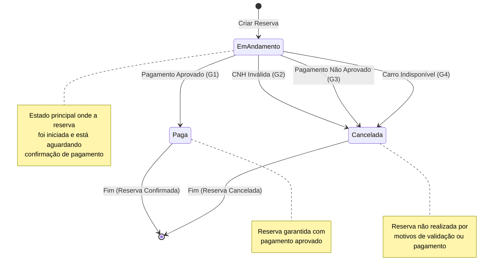
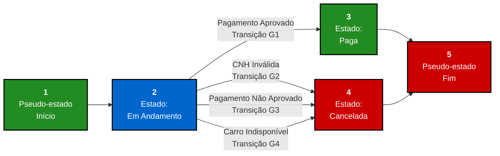

O Diagrama de Transição de Estados modela o ciclo de vida do objeto `Reserva`, mostrando os estados pelos quais ele passa e as transições que ocorrem em resposta a eventos.

### Grafo de Estados (GE)

### Estados do Objeto Reserva

- **Em Andamento:** Estado inicial quando a reserva é criada e confirmada pelo cliente (após dados validados)
- **Cancelada:** A reserva foi cancelada (CNH inválida, pagamento recusado, carro indisponível)
- **Paga:** O pagamento foi aprovado e a reserva está garantida

### Transições e Eventos

- **(G1) Em Andamento → Paga:** Evento: "Pagamento Aprovado" - Resultado de sucesso do caso de uso
- **(G2) Em Andamento → Cancelada:** Evento: "CNH Inválida" - Validação falha na verificação de CNH
- **(G3) Em Andamento → Cancelada:** Evento: "Pagamento Não Aprovado" - API de pagamento rejeita a transação
- **(G4) Em Andamento → Cancelada:** Evento: "Carro Indisponível" - Carro não está disponível para período solicitado

### Casos de Teste para o Objeto Reserva (Sequências de Teste)

Os casos de teste a seguir são sequências de teste que exercitam os estados e transições do objeto Reserva:

| ID | Sequência de Teste | Estado Inicial | Eventos | Estado Final | Transição | Validação |
|---|---|---|---|---|---|---|
| CTOBJ01 | Reserva → Sucesso | [*] Início | 1. Criar Reserva → 2. Pagamento Aprovado | Paga | [*]→Em Andamento→Paga→[*] | (G1) Transição válida - Reserva confirmada |
| CTOBJ02 | Reserva → CNH Inválida | [*] Início | 1. Criar Reserva → 2. CNH Inválida | Cancelada | [*]→Em Andamento→Cancelada→[*] | (G2) Transição válida - Reserva cancelada por CNH |
| CTOBJ03 | Reserva → Pagamento Recusado | [*] Início | 1. Criar Reserva → 2. Pagamento Não Aprovado | Cancelada | [*]→Em Andamento→Cancelada→[*] | (G3) Transição válida - Reserva cancelada por pagamento |
| CTOBJ04 | Reserva → Carro Indisponível | [*] Início | 1. Criar Reserva → 2. Carro Indisponível | Cancelada | [*]→Em Andamento→Cancelada→[*] | (G4) Transição válida - Reserva cancelada por indisponibilidade |
